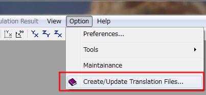
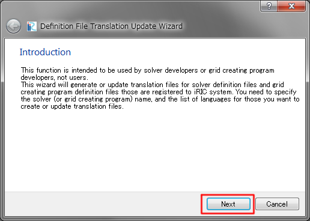
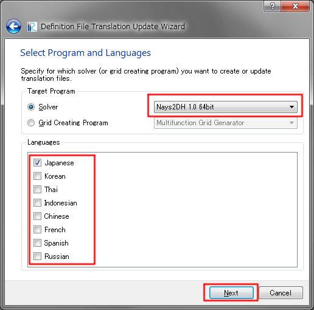

Solver translation
===================

Step 1
------

Create or update the translation file (*.ts) for the solver you
want to prepare translation.

1. Select [Option] --> [Create/Update Translation Files] in iRIC GUI menu.
   Refer to :numref:`img_tr_menu`.

2. Click the next button on the dialog in :numref:`img_tr_wizard_introduction`.

3. Select Solver and Languages you want to prepare translation on the dialog in
   :numref:`img_tr_wizard_select`. Click the Next button.

4. Click the Finish button. The path you'll get translation file (*.ts) is shown
   on the dialog, as in :numref:`img_tr_wizard_confirm`.

.. _img_tr_menu:

   "Create/Update Translation Files" menu

.. _img_tr_wizard_introduction:

   Introduction page

.. _img_tr_wizard_select:

   Select Program and Languages page

.. _img_tr_wizard_confirm:

.. figure:: images/tr_wizard_confirm.png

   Confirm the result page

Step 2
------

Open the translation file with text editor and add translations for each English word.
Please refer :numref:`code_ts_before_editing_solver` and
:numref:`code_ts_after_editing_solver`.

.. code-block:: xml
   :caption: *.ts before editing
   :name: code_ts_before_editing_solver

   <message>
      <source>Boundary Condition</source>
      <translation></translation>
   </message>

.. code-block:: xml
   :caption: *.ts after editing
   :name: code_ts_after_editing_solver

   <message>
     <source>Boundary Condition</source>
     <translation>境界条件</translation>
   </message>

What you should do is as follows:

1. Add translated text between <translation> and </translation>
2. Save the file

Step 3
-------

You can see the translated text in the iRIC software when you restart
the iRIC and starts a project for the solver you prepared translation file.
