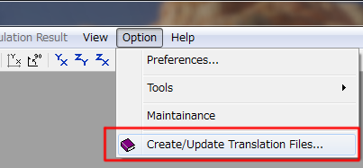
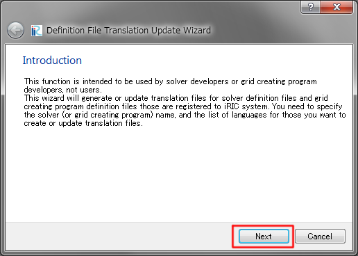
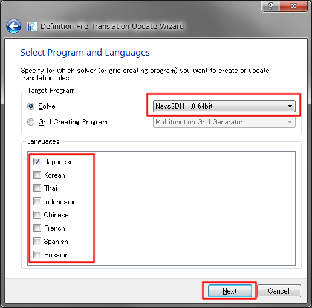
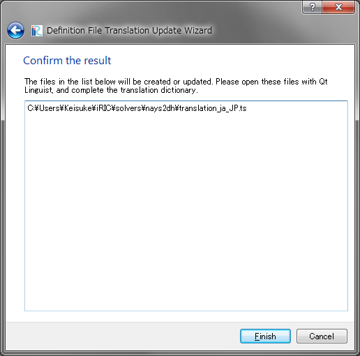

.. _for_volunteers:

Information for internationalization volunteers
=======================================================

Thank you for your coorporation to iRIC internationalization.

In this page, we introduce information for volunteer translators.

* iRIC GUI translation
* Solver translation

iRIC GUI translation
-----------------------

You can translate iRIC GUI with the four steps below:

1. Create github account.
2. Fork iRIC GUI repository.
3. Edit dictionary to add translation.
4. Send pull request.

Create github account
~~~~~~~~~~~~~~~~~~~~~~~

Please access github from the following URL.

https://github.com/

On the page you can input Username, Email, and Password to sign up.

Fork iRIC GUI repository
~~~~~~~~~~~~~~~~~~~~~~~~~~~~

After you've created github account and signed in, please visit the following URL:

https://github.com/i-RIC/prepost-gui

You will have "Fork" button on the top right of the screen.
Please click the button, to fork the repository.

After some time passes, you will be at URL like below:

https://github.com/(your_account_id)/prepost-gui

Edit dictionary to add translation.
~~~~~~~~~~~~~~~~~~~~~~~~~~~~~~~~~~~~~

Now you can edit the dictionary file.

If you are familier with github, you can clone the repository to
create local copy, edit files, and push the modification to the repository.

If you are new to github, the easiest way is to edit the file on web browser.

All the dictionary files are saved in "languages" folder, so please access that folder,
and click on the file you want to edit.

Then, please click on the pencil icon with popup "Edit this file", to start editing.

:numref:`code_ts_before_editing_vol` and :numref:`code_ts_after_editing_vol` shows
an example of code before and after editing. 

.. code-block:: xml
   :caption: *.ts before editing
   :name: code_ts_before_editing_vol

   <message>
     <location filename="../main/animationcontroller.cpp" line="48"/>
     <source>Animation ToolBar</source>
     <translation type="unfinished"></translation>
   </message>

.. code-block:: xml
   :caption: *.ts after editing
   :name: code_ts_after_editing_vol

   <message>
     <location filename="../main/animationcontroller.cpp" line="48"/>
     <source>Animation ToolBar</source>
     <translation>アニメーションツールバー</translation>
   </message>

What you should do is as follows:

1. Delete "type=unfinished"
2. Add translated text between <translation> and </translation>

Send pull request
~~~~~~~~~~~~~~~~~~~~

When you finished editing the file, check on the "Create a new branch for this commit and start a pull request".

The default name for your new branch will be "(your-account-id)-patch-1", so edit it to make it easier to know
what it does, for example "solverconsole-es-translation".

Now please visit the following URL.

https://github.com/i-RIC/prepost-gui

Then you'll see "Compare & pull request" button, so please click it.
"Open a pull request" page will be shown, so please click on "Create pull request" button.
If you want to, you can add comments to the pull request.

Conguratulation! You've finished editing the dictionary of iRIC.

iRIC developers will review the changes you made, and if there is no problem,
it will be merged, and the modification you've made will be applied to the next release.

Solver translation
-----------------------

Dictionaries for solvers are independent from those for iRIC GUI.

For example, messages and captions shown on "Calculation Condition" dialog
is specific to solvers, so the messages are included in solver translation
dictionary.

You can translate solver with the three steps below:

1. Create dictionary file.
2. Edit dictionary to add translation.
3. Upload dictionary to iRIC forum page

Create dictionary file
~~~~~~~~~~~~~~~~~~~~~~~~~~

Create or update the translation file (*.ts) for the solver you
want to prepare translation.

1. Select [Option] --> [Create/Update Translation Files] in iRIC GUI menu.
   Refer to :numref:`img_tr_menu_vol`.

2. Click the next button on the dialog in :numref:`img_tr_wizard_introduction_vol`.

3. Select Solver and Languages you want to prepare translation on the dialog in
   :numref:`img_tr_wizard_select_vol`. Click the Next button.

4. Click the Finish button. The path you'll get translation file (*.ts) is shown
   on the dialog, as in :numref:`img_tr_wizard_confirm_vol`.

.. _img_tr_menu_vol:

   "Create/Update Translation Files" menu

.. _img_tr_wizard_introduction_vol:

   Introduction page

.. _img_tr_wizard_select_vol:

   Select Program and Languages page

.. _img_tr_wizard_confirm_vol:

   Confirm the result page

Edit dictionary to add translation
~~~~~~~~~~~~~~~~~~~~~~~~~~~~~~~~~~~~~~~

Open the translation file with text editor and add translations for each English word.
Please refer :numref:`code_ts_before_editing_solver_vol` and
:numref:`code_ts_after_editing_solver_vol`.

.. code-block:: xml
   :caption: *.ts before editing
   :name: code_ts_before_editing_solver_vol

   <message>
      <source>Boundary Condition</source>
      <translation></translation>
   </message>

.. code-block:: xml
   :caption: *.ts after editing
   :name: code_ts_after_editing_solver_vol

   <message>
     <source>Boundary Condition</source>
     <translation>境界条件</translation>
   </message>

What you should do is as follows:

1. Add translated text between <translation> and </translation>
2. Save the file

Upload dictionary to iRIC forum page
~~~~~~~~~~~~~~~~~~~~~~~~~~~~~~~~~~~~~~~~~

Please upload the dictionary to iRIC forum page, from the URL below:

https://i-ric.org/en/new-forum/

Please input Subject like "Spanish dictionary proposal", Select Category for the
solver name, and please attach the dictionary file you've edited. Then,
click on "Submit" button to send the file.

Conguratulation! You've finished editing the dictionary of solver.

Solver developers will review the changes you made, and if there is no problem,
it will be merged, and the modification you've made will be applied to the next release.
