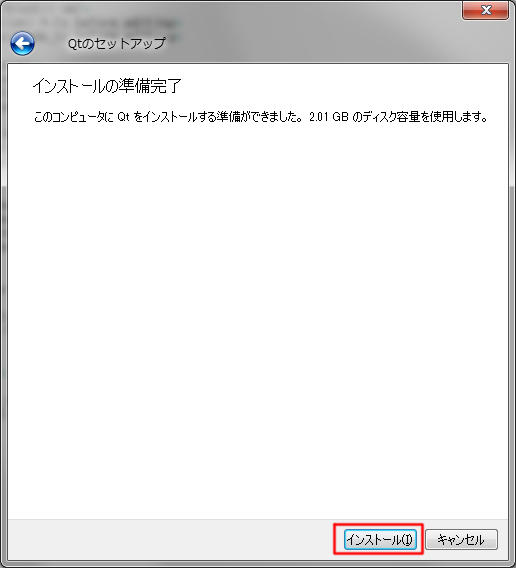

.. _sec_appendix:

Appendix: Installilng Qt SDK
=============================

You can download the Qt SDK installer from following url:

https://www.qt.io/download-open-source

1. Click on "Download the Qt Online Installer". It is at almost the bottom of the page.
2. Click on "Qt Online Installer for Windows" link.

Then, you'll get qt-unified-windows-x64-4.5.2-online.exe (Maybe the version number is different).

Now, launch the installer by double-clicking.

1. In :numref:`qt_installer1`, click on "Next" button.
   If you are connecting internet where you need proxy setting,
   Please press "Setting" button before you proceed, to setup
   proxy setting.

2. In :numref:`qt_installer2`, click on "Skip" button.
   If you already have Qt account, or want to create a new Qt Account,
   You can fill in "Login" or "Sign-up" form.

3. In :numref:`qt_installer3`, click on "Next" button.
   Downloading meta data about files to install will start.
   This will take some time.

4. In :numref:`qt_installer4`, enter the directory where you want to
   install Qt, and click on "Next" button.

5. In :numref:`qt_installer5`, check on Qt / Qt 5.5 / msvc2013 64-bit,
   and click on "Next" button.

6. In :numref:`qt_installer6`, read the license, check on
   "I have read and agree to the terms contained in the license agreements",
   and click on "Next" button.

7. In :numref:`qt_installer7`, click on "Next" button.

8. In :numref:`qt_installer8`, click on "Install" button.

.. _qt_installer1:

.. figure:: images/qt_installer1.png

   Qt Installer welcome page

.. _qt_installer2:

   Qt Account page

.. _qt_installer3:

   Qt Installer setup page

.. _qt_installer4:

   Qt Install folder select page

.. _qt_installer5:

   Component select page

.. _qt_installer6:

   License agreement page

.. _qt_installer7:

   Start menu shortcut page

.. _qt_installer8:

   Install ready page
